### Summary

Микросервис предназначен для обеспечения централизованного управления общей конфигурацией в приложении Edo. Он облегчает загрузку и обновление конфигурации в различных микросервисах, что позволяет легко внедрять изменения и обеспечивать единообразность конфигурации во всем приложении. Тут хранятся общие конфиги и настройки безопасности для всех микросервисов.

### Основные функции
- Хранение общей конфигурации приложения Edo.
- Загрузка и обновление конфигурации в реальном времени.
- Распространение обновленной конфигурации между микросервисами приложения.
- Управление версиями конфигурации и контроль доступа к ней.
- Предоставление API для получения конфигурации из других микросервисов.

### Настройка аутентификации
Для активации аутентификации в модуле, необходимо, в модуле, в котором хотите включить
изменить настройку в application.yml security.enabled с false на true и раскомментировать profiles:include:security

и настроить Keycloak согласно документации

Для запуска keycloak через docker введите данную команду в терминале:
docker run -p 8181:8080 -e KEYCLOAK_ADMIN=admin -e KEYCLOAK_ADMIN_PASSWORD=admin quay.io/keycloak/keycloak:20.0.3
start-dev

Далее пройдя по адресу http://localhost:8181/ выбираем Administration Console и будет окно для ввода логина и пароля для
keycloak.

Введите username=admin, password=admin.

Вы войдете в master realm.

Выбираем создать realm.
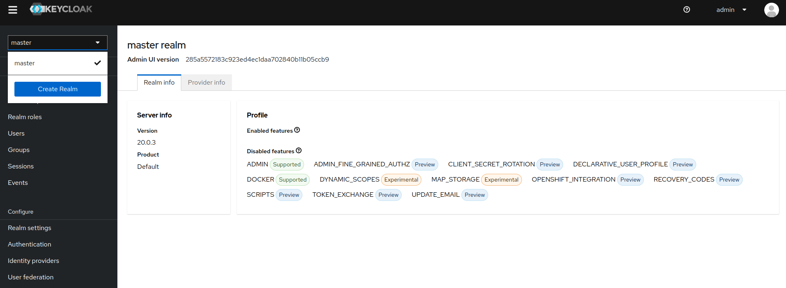
Вводим имя edo-project-realm.
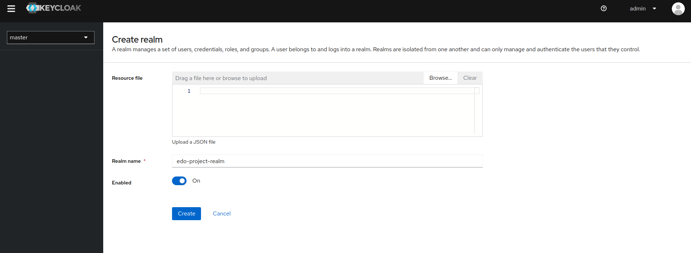
Дальше выбираем вкладку Clients и нажимаем на кнопку Create client.
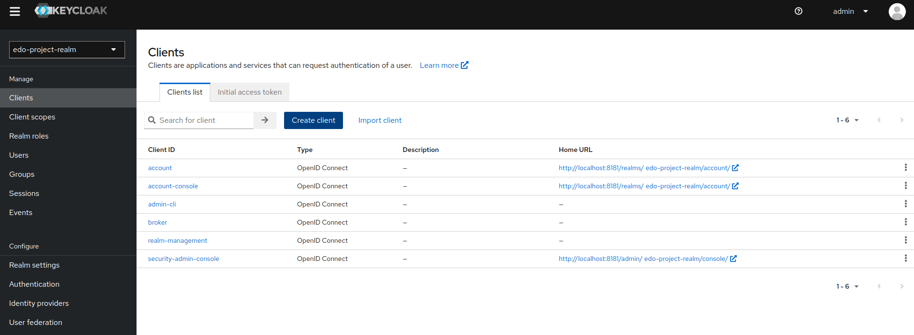
В ClientID вводим edo-project-client.

Настройки безопасности оставляем по умолчанию.
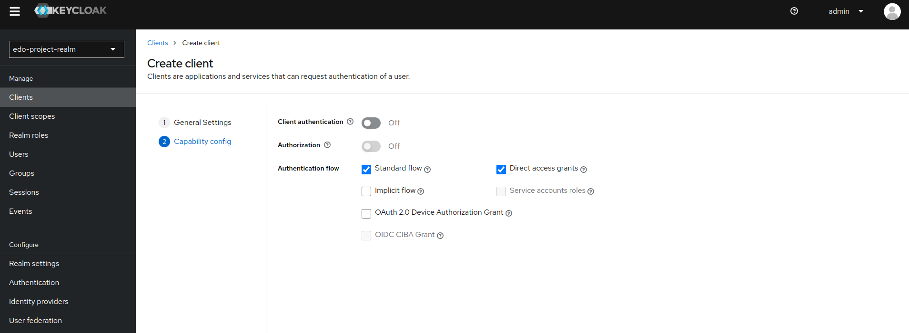
Нажимаем save.

В поле Valid redirect URIs ставим заглушку "*" и сохраняем

Во вкладке Clients выбираем наш клиент и далее в Roles нажимаем кнопку Create role.
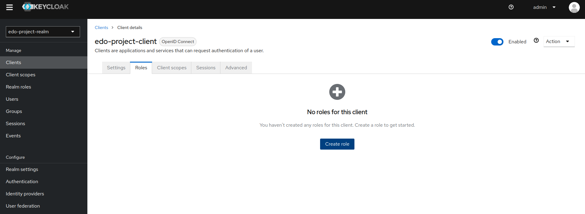
Далее вводим название роли admin и сохраняем.
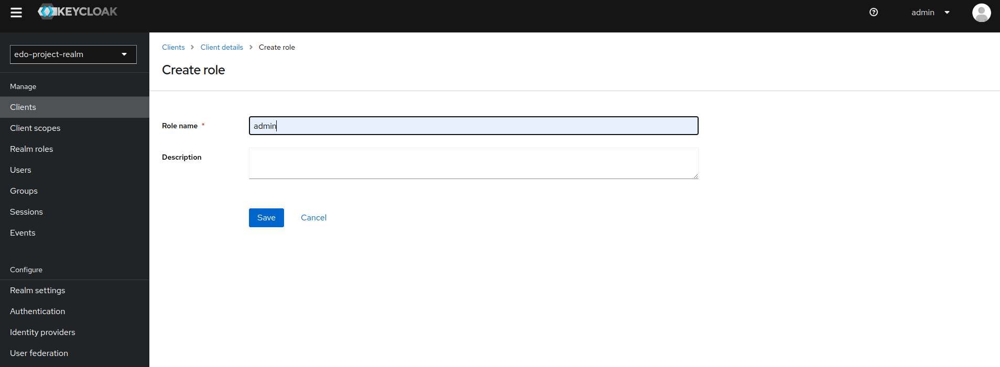
Переходим во вкладку Realm roles и нажимаем на кнопку Create role.
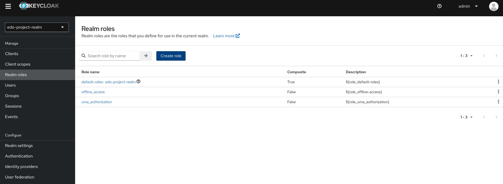
Вводим название роли api_admin и сохраняем.

В этой же вкладке справа сверху выбираем Action -> Add associated roles.

Далее выбираем вкладку Filter by clients.
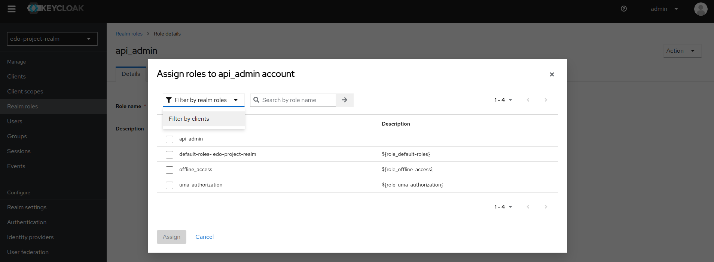
Ставим галочку на edo-project-client admin и нажимаем Assign.
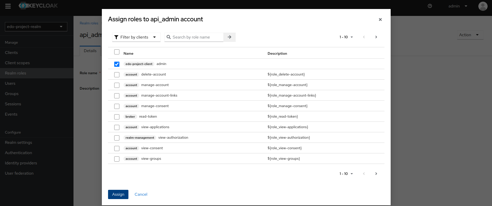
Далее переходим на вкладку Users и выбираем Create new user.
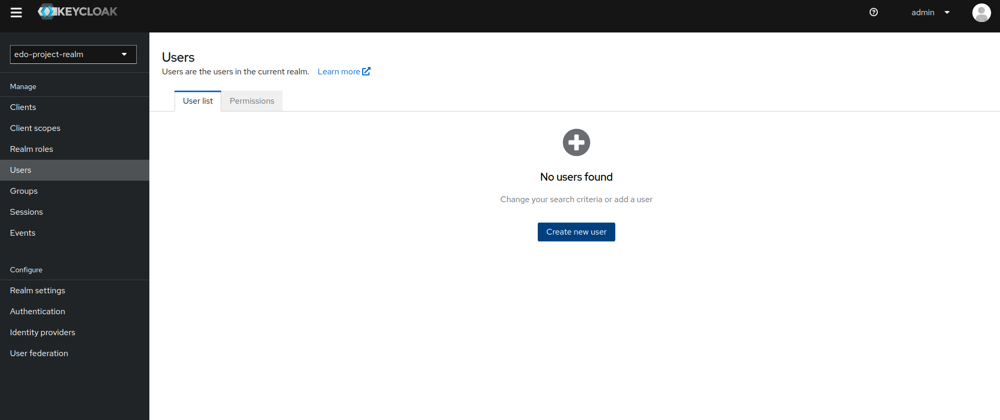
Вводим имя admin и сохраняем.
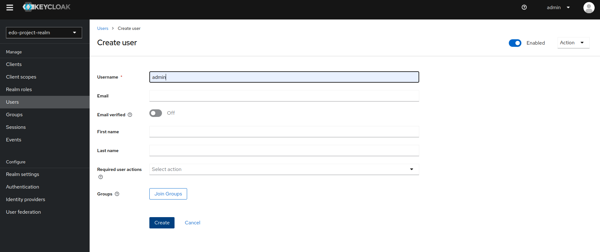
Тут же переходим во вкладку Credentials и нажимаем кнопку Set password.

Вводим два раза пароль, деактивируем Temporary и нажимаем сохранить.
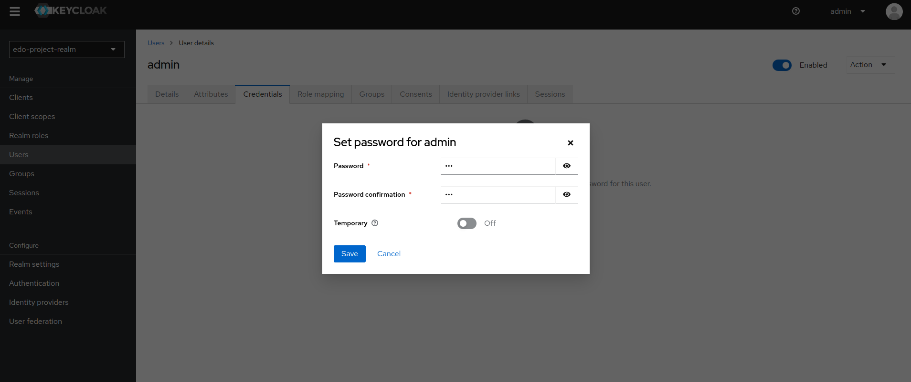
Тут же переходим на вкладку Role mapping и нажимаем кнопку Assign role.
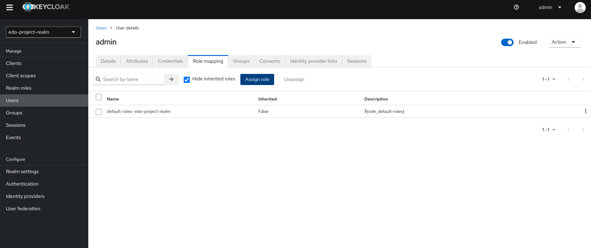
Далее переходим во вкладку Filter by clients и выбираем edo-project-client admin и нажимаем Assign.
Все готово для работы с keycloak.

При первом переходе на endpoint появится окно с вводом логина и пароля. 
Там необходимо будет ввести admin и пароль, который вы придумали при создании юзера.

**Работа через Postman**

Сначала необходимо получить токен через post-запрос 
по адресу http://localhost:8181/realms/edo-project-realm/protocol/openid-connect/token

В теле запроса вводим:

KEY      VALUE

grant_type -> password

client_id -> edo-project-client

username -> admin

password -> ваш_пароль
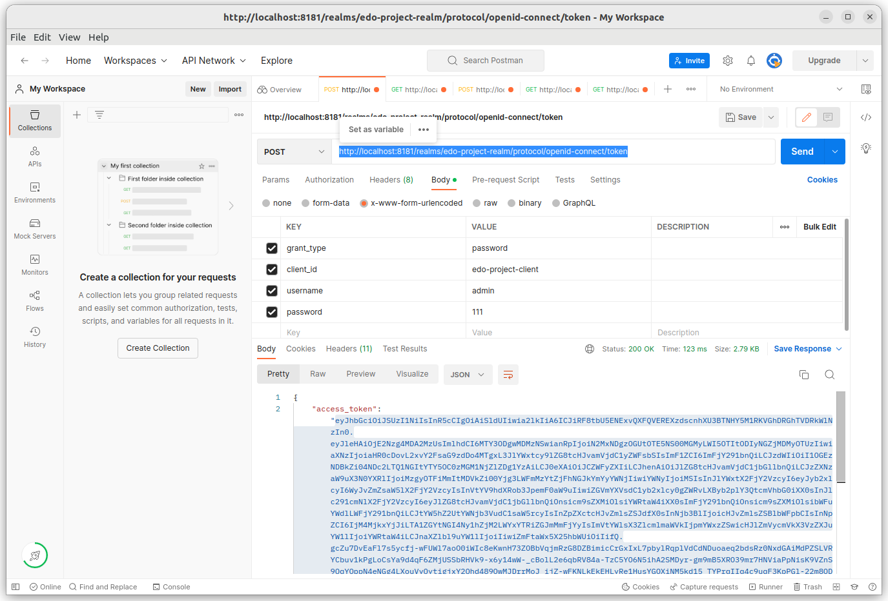
Получаем токен, копируем его.
И уже при get-запросе на endpoint выбираем тип авторизации Bearer Token и в поле Token
вводим полученный ранее токен.
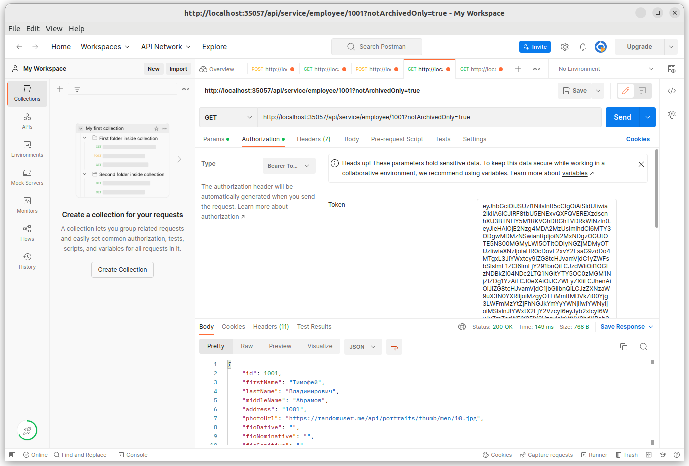
